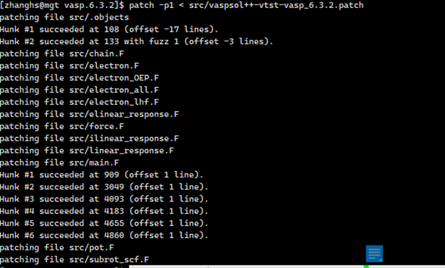
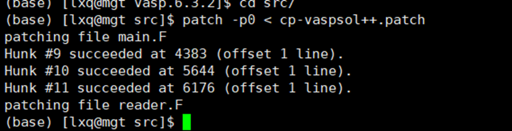

# VASP 6.3.2 + VTST + VASPsol++ + CP-VASP 完整安装指南

本指南整合 VASP 6.3.2 基础安装、VTST 过渡态工具、VASPsol++ 溶剂模型以及 CP-VASP 恒电势方法的完整编译流程。

---

## 一、VASP 6.3.2 基础安装

&gt; 参考链接：https://www.bilibili.com/opus/682064175698018357

VASP（Vienna Ab-initio Simulation Package）是进行电子结构计算和分子动力学模拟的软件包。以下安装步骤在 Parallels Desktop 17 虚拟机的 Ubuntu 20.04.2 系统上验证通过。

### Step 1：安装 Ubuntu 20.04.2

通过 PD17 安装默认的 Ubuntu 20.04.2 虚拟机即可（VASP 官网推荐 18.xx，但 20.04.2 同样适用）。

### Step 2：更新系统 & 安装编译器

1. **选择最快的下载源**：`select best server`
2. **更新系统**：
   ```bash
   sudo apt update
   sudo apt upgrade
3. **安装编译所需包**：
   ```bash
   sudo apt install build-essential
   ```
4. **安装 gcc, g++, gfortran**：
   ```bash
   sudo apt install gcc g++ gfortran
   ```
   > **提示**：可用 `which gcc` / `which g++` / `which gfortran` 查看是否已安装。若显示路径则已存在，无需重复安装。

### Step 3：安装 Intel oneAPI 编译器

访问 Intel 官网：[oneAPI Toolkits](https://www.intel.cn/content/www/cn/zh/developer/tools/oneapi/toolkits.html)

#### 1. 安装 Intel oneAPI Base Toolkit
```bash
sudo sh ./l_BaseKit_p_2022.2.0.262.sh
```
按引导安装，**只需选择 MKL** 即可。

#### 2. 安装 Intel oneAPI HPC Toolkit
类似方式安装，选择 **Fortran、C++、MPI Library**。

#### 3. 声明环境变量（单次有效）
```bash
source /opt/intel/oneapi/setvars.sh
```
> **提示**：若使用 Intel 2024+ 版本，`icc` 变为 `icx`，`icpc` 变为 `icpx`，`mpiifort` 变为 `mpiifx`。

#### 4. 验证安装
```bash
which icc ifort mpirun mpiifort
```
若显示路径则安装成功。

### Step 4：配置 VASP 编译环境

1. **配置 makefile**：
   ```bash
   cp arch/makefile.include.linux_intel makefile.include
   ```
   编辑 `makefile.include`，**删除 `MKLROOT =` 后面的内容**（保留空值，因为已通过环境变量声明）。

2. **编译 MKL FFTW 接口**：
   ```bash
   cd /opt/intel/oneapi/mkl/2022.1.0/interfaces/fftw3xf
   sudo su
   source /opt/intel/oneapi/setvars.sh
   make libintel64
   exit
   ```

### Step 5：编译 VASP
在 VASP 根目录执行：
```bash
make all
```
编译耗时约 30-60 分钟。

### Step 6：测试
```bash
make test
```
若部分测试失败，在 `~/.bashrc` 中添加：
```bash
ulimit -s unlimited
ulimit -c unlimited
```
然后重新执行 `make test`。

### Step 7：配置环境变量

1. **添加 VASP 到 PATH**（根据实际路径修改）：
   ```bash
   # 添加到 ~/.bashrc
   PATH=/home/parallels/vasp/vasp.6.3.0/vasp.6.3.0/build/std:$PATH
   export PATH
   ```

2. **自动声明 Intel 环境**（避免每次手动 source）：
   ```bash
   echo "source /opt/intel/oneapi/setvars.sh" >> ~/.bashrc
   source ~/.bashrc
   ```

3. **并行运行 VASP**：
   ```bash
   mpirun -np 4 vasp
   ```

---

## 二、VTST 编译安装

> 参考链接：<https://zhuanlan.zhihu.com/p/8591076280>  
> 官网：<http://theory.cm.utexas.edu/vtsttools/download.html>

> **注意**：VASP 6.3.2 编译 VTST 199 版本可能报错，建议使用 **vtstcode-204** 或 **vtstcode6.3** 版本。

### 1. 下载并解压 VTST
```bash
tar -zxvf vtstcode-204.tgz
```

### 2. 修改 VASP 源码

进入 `vasp.6.3.2/src/` 目录操作：

#### (1) 备份关键文件
```bash
cd vasp.6.3.2/src/
cp main.F main.F_original
cp .objects .objects_original
```

#### (2) 修改 main.F

编辑 `main.F`：

**修改 1**（约第 3542 行）：  
找到 `CHAIN_FORCE` 调用，在 `TIFOR,` 后添加 `TSIF,`：

```fortran
! 原代码：
CALL CHAIN_FORCE(T_INFO%NIONS,DYN%POSION,TOTEN,TIFOR, &
LATT_CUR%A,LATT_CUR%B,IO%IU6)

! 修改为：
CALL CHAIN_FORCE(T_INFO%NIONS,DYN%POSION,TOTEN,TIFOR, &
TSIF,LATT_CUR%A,LATT_CUR%B,IO%IU6)
```

**修改 2**（约第 940 行）：  
删除 `IF (LCHAIN)` 条件判断：

```fortran
! 原代码：
IF (LCHAIN) CALL chain_init(T_INFO, IO)

! 修改为：
CALL chain_init(T_INFO, IO)
```

保存退出（`:wq`）。

#### (3) 修改 .objects 文件

编辑 `.objects`（隐藏文件），在 `chain.o \` 前添加以下内容：

```makefile
bfgs.o \
dynmat.o \
instanton.o \
lbfgs.o \
sd.o \
cg.o \
dimer.o \
bbm.o \
fire.o \
lanczos.o \
neb.o \
qm.o \
pyamff_fortran/*.o \
ml_pyamff.o \
opt.o \
```

> **注意**：确保每行末尾的 `\` 后没有空格。

#### (4) 复制 VTST 源文件
将 `vtstcode-204/vtstcode6.3/` 目录下**所有文件**复制到 `vasp/src/`：
```bash
cp /path/to/vtstcode-204/vtstcode6.3/* /path/to/vasp.6.3.2/src/
```

#### (5) 修改 Makefile

编辑 `vasp.6.3.2` 根目录下的 `makefile`：

1. 找到 `LIB` 变量，修改为：
   ```makefile
   LIB = lib parser pyamff_fortran
   ```

2. 添加依赖项（如果是并行编译）：
   ```makefile
   dependencies: sources libs
   ```

### 3. 重新编译
```bash
cd vasp.6.3.2
make all
```

---

## 三、VASPsol++ 安装

VASPsol++ 实现于 `solvation.F`，需要针对不同 VASP 版本应用补丁。

### 补丁版本说明
- **VASP 5.4.4**：带/不带 VTST 的补丁
- **VASP 6.3.2**：带/不带 VTST 的补丁
- 补丁需邮件联系 Craig Plaisance 获取，或从 release 页面下载

### 安装步骤（基础版）

假设 VASP 源码目录为 `<VASP_SRC>`：

1. 下载并解压：
   ```bash
   tar -xzf vaspsol-pp-<version>.tar.gz
   ```

2. 复制溶剂化模块：
   ```bash
   cp <VASPPSOL_SRC>/src/solvation.F <VASP_SRC>/src/
   ```

3. 应用补丁（选择对应版本）：
   ```bash
   cd <VASP_SRC>
   # 不带 VTST：
   patch -p1 < vaspsol++-vasp_6.3.2.patch
   # 带 VTST：
   patch -p1 < vaspsol++-vtst-vasp_6.3.2.patch
   ```

4. 重新编译：
   ```bash
   make all
   ```

### VASPsol++ + VTST 组合编译

如果已安装 VTST，需要应用 VTST 兼容补丁：

```bash
cd vasp.6.3.2
patch -p1 < src/vaspsol++-vtst-vasp_6.3.2.patch
```

成功后会显示类似 `succeeded` 的提示如图

然后执行：
```bash
make all
```

---

## 四、CP‑VASP 安装

CP‑VASP 需要先安装 **VASPsol** 或 **VASPsol++**。

### 版本兼容性

| 溶剂模型 | VASP 版本 | 补丁文件 |
|---------|----------|---------|
| VASPsol++ | VASP 6.3 | `cp-vaspsol++.patch` |
| VASPsol | VASP 6.4 | `cp-vaspsol.patch` |

- VASPsol: <https://github.com/henniggroup/VASPsol>
- VASPsol++: <https://gitlab.com/cplaisance/vaspsol_pp>

### 安装步骤

1. **进入 VASP 源码目录**：
   ```bash
   cd vasp.6.3.2/src
   ```

2. **复制补丁文件**到 `src` 目录（根据已安装的溶剂模型选择）：
   - 若使用 VASPsol++：`cp-vaspsol++.patch`
   - 若使用 VASPsol：`cp-vaspsol.patch`

3. **应用补丁**（以 VASP 6.3 + VASPsol++ 为例）如图所示：

   ```bash
   patch -p0 < cp-vaspsol++.patch
   ```

   **补丁修改内容**：
   - **VASPsol++**：修改 `main.F` 和 `reader.F`
   - **VASPsol**：修改 `main.F`、`pot.F`、`reader.F` 和 `solvation.F`

4. **重新编译**：
   ```bash
   cd ..
   make all
   ```

   > **提示**：通常不需要 `make veryclean`，但如果编译出错可尝试：
   > ```bash
   > make veryclean
   > make all
   > ```

---

## 五、故障排除与技巧

### 1. 编译 VTST 时报错
- **现象**：`chain.F` 第 202 行附近报错，提示缺少 `endif`
- **解决**：使用 VTST 204 版本或 vtstcode6.3，不要直接使用 199 版本

### 2. 测试失败
在 `~/.bashrc` 中添加：
```bash
ulimit -s unlimited
ulimit -c unlimited
```
然后重新 `make test`

### 3. 环境变量快速配置
将以下内容添加到 `~/.bashrc`：
```bash
# Intel oneAPI 环境
source /opt/intel/oneapi/setvars.sh

# VASP 路径（根据实际安装路径修改）
PATH=/home/username/vasp/vasp.6.3.2/build/std:$PATH
export PATH
```

### 4. 文件备份习惯
修改源码前务必备份：
```bash
cp main.F main.F_backup
cp .objects .objects_backup
```

---

## 六、验证安装

测试各功能是否正常：

```bash
# 测试 VASP 基础功能
make test

# 测试 VTST（使用 NEB 或 Dimer 计算）
# 需准备对应的 INCAR 标签如 ICHAIN=1

# 测试 VASPsol++（在 INCAR 中添加）：
# LSOL = .TRUE.
# EB_K = 80.0

# 测试 CP-VASP（在 INCAR 中添加）：
# LSOL = .TRUE.
# NELECT = [目标电子数]
```

---

## 参考链接

1. VASP 安装教程：<https://www.bilibili.com/opus/682064175698018357>
2. VTST 编译指南：<https://zhuanlan.zhihu.com/p/8591076280>
3. VTST 官方文档：<http://theory.cm.utexas.edu/vtsttools/download.html>
4. 计算化学论坛：<http://bbs.keinsci.com/thread-46112-1-1.html>
5. VASPsol++ GitLab：<https://gitlab.com/cplaisance/vaspsol_pp>
6. VASPsol GitHub：<https://github.com/henniggroup/VASPsol>

---

*本指南整合了 VASP 6.3.2、VTST、VASPsol++ 和 CP-VASP 的完整安装流程，适用于恒电势计算和溶剂化效应研究。*
```

---
